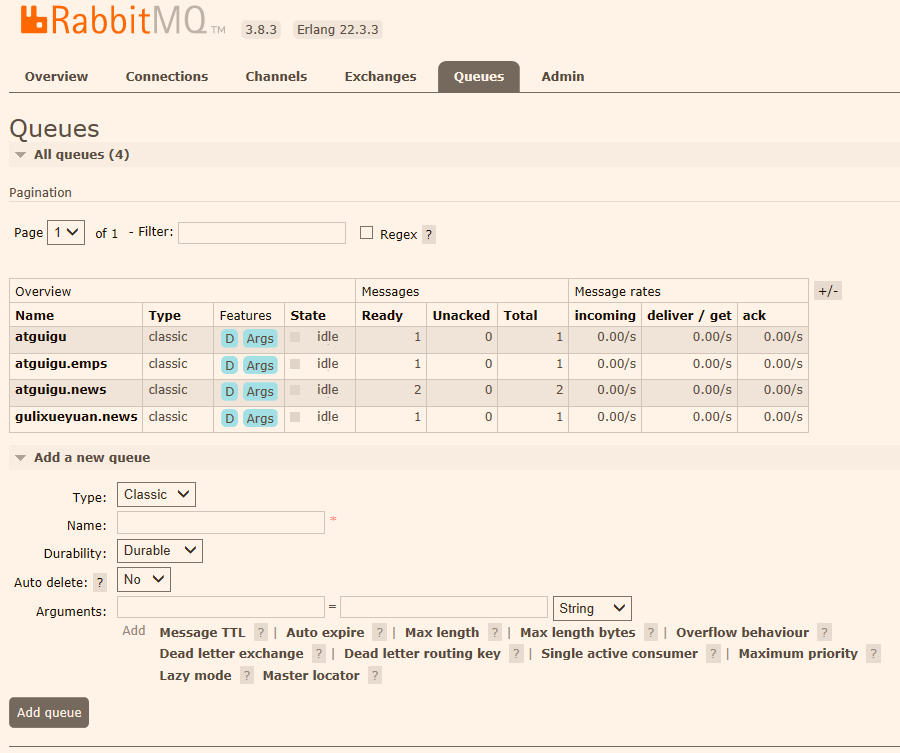

# 一、rabbitMQ的测试

## 1.1测试类代码

```java
package com.oRuol.amqp;

import com.oRuol.amqp.bean.Book;
import org.junit.jupiter.api.Test;
import org.springframework.amqp.core.Message;
import org.springframework.amqp.rabbit.core.RabbitTemplate;
import org.springframework.beans.factory.annotation.Autowired;
import org.springframework.boot.autoconfigure.AutoConfigureOrder;
import org.springframework.boot.test.context.SpringBootTest;

import java.util.Arrays;
import java.util.HashMap;
import java.util.Map;

@SpringBootTest
class SpringbootAmqpApplicationTests {

    @Autowired
    RabbitTemplate rabbitTemplate;

    /**
     * 发送数据到rabbitmq对应的队列中的方法
     */
    @Test
    void contextLoads() {
//        message需要自己构造一个，定义消息体内容和消息头
//        rabbitTemplate.send(exchange,routingKey, Message);

//        object默认当成消息体，只需要传入要发送的对象，自动序列化发送给rabbitmq;
//        rabbitTemplate.convertAndSend(exchage,routeKey,Object);


//        Map<String,Object> map = new HashMap<>();
//        map.put("msg","这是第一个消息");
//        map.put("date", Arrays.asList("helloworld",123,true));
////        map对象被默认序列化以后发送出去
//        rabbitTemplate.convertAndSend("exchange.direct","atguigu.news",map);

        //测试direct类型的exchange 自定义类存入消息队列，自定义类需要实现序列化接口，还得有无参构造方法
//        Book book = new Book("曹雪芹", "红楼", "100");
//        rabbitTemplate.convertAndSend("exchange.direct","atguigu.news",book);

        //测试fanout类型的exchange
//        Book book = new Book("曹雪芹", "红楼", "100");
//        rabbitTemplate.convertAndSend("exchange.fanout","",book);

        //测试topic类型的exchange
        Book book = new Book("曹雪芹", "红楼", "100");
        rabbitTemplate.convertAndSend("exchange.topic","atguigu.time",book);
    }

    /**
     * 从rabbitmq中接收数据的方法
     */
    @Test
    public void receive(){
        Object o = rabbitTemplate.receiveAndConvert("atguigu.news");
        System.out.println(o.getClass());
        System.out.println(o);
    }

}
```

## 1.2更改rabbitMQ的messageConverter设置为json格式的序列化方式

```java
package com.oRuol.amqp.config;

import org.springframework.amqp.rabbit.config.SimpleRabbitListenerContainerFactory;
import org.springframework.amqp.rabbit.connection.ConnectionFactory;
import org.springframework.amqp.rabbit.core.RabbitTemplate;
import org.springframework.amqp.support.converter.Jackson2JsonMessageConverter;
import org.springframework.amqp.support.converter.MessageConverter;
import org.springframework.beans.factory.annotation.Autowired;
import org.springframework.beans.factory.annotation.Configurable;
import org.springframework.context.annotation.Bean;
import org.springframework.context.annotation.Configuration;

/**
 * @author oRuol
 * @Date 2020/5/7 18:23
 */
@Configuration
public class MyAMQPConfig {

    @Autowired
    org.springframework.amqp.rabbit.connection.ConnectionFactory connectionFactory;

    /**
     * 设置rabbitMq的messageConverter的方式一、
     *      可以通过创建一个RabbitTemplate对象，通过RabbitTemplate对象的setMessageConverter()方法
     *      来设置messageConverter
     * @return
     */
//    @Bean
//    public RabbitTemplate messageConverter(){
//        RabbitTemplate rabbitTemplate = new RabbitTemplate(connectionFactory);
//        rabbitTemplate.setMessageConverter(new Jackson2JsonMessageConverter());
//        return rabbitTemplate;
//    }

    /**
     * 设置rabbitMq的messageConverter的方式二、
     *      直接创建一个MessageConverter Bean对象
     * @return
     */
    @Bean
    public MessageConverter messageConverter(){
        return new Jackson2JsonMessageConverter();
    }
}
```

## 1.3自定义的测试序列化的类

```java
package com.oRuol.amqp.bean;

import java.io.Serializable;

/**
 * @author oRuol
 * @Date 2020/5/8 17:23
 */
public class Book implements Serializable {

    private String author;
    private String bookName;
    private String price;

    public Book() {
    }

    public Book(String author, String bookName, String price) {
        this.author = author;
        this.bookName = bookName;
        this.price = price;
    }

    @Override
    public String toString() {
        return "Book{" +
                "author='" + author + '\'' +
                ", bookName='" + bookName + '\'' +
                ", price='" + price + '\'' +
                '}';
    }

    public String getAuthor() {
        return author;
    }

    public void setAuthor(String author) {
        this.author = author;
    }

    public String getBookName() {
        return bookName;
    }

    public void setBookName(String bookName) {
        this.bookName = bookName;
    }

    public String getPrice() {
        return price;
    }

    public void setPrice(String price) {
        this.price = price;
    }
}
```

## 1.4rabbitMQ的properties配置文件

```properties
spring.rabbitmq.host=192.168.23.78
spring.rabbitmq.username=guest
spring.rabbitmq.password=guest
#spring.rabbitmq.port=5672
#spring.rabbitmq.virtual-host=/
```

## 1.5rabbitMQ的exchanges配置


## 1.5rabbitMQ的Queues配置



## 1.6rabbitMQ的exchanges对应的bindings规则


